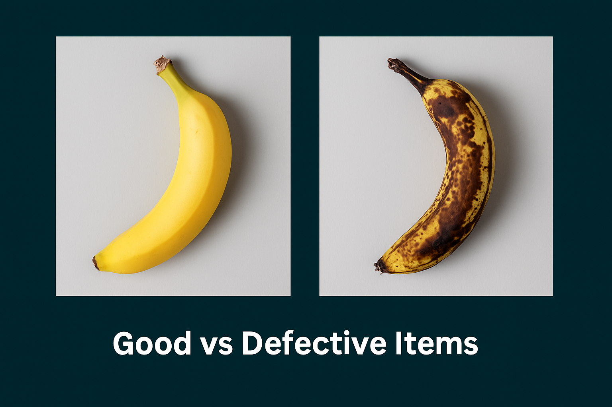

# banana-defect-detector

# 🍌 InspectorsAlly – Banana Defect Detector

A lightweight, AI-powered visual inspection tool inspired by [InspectorsAlly](https://epiphany.ai/). This app classifies bananas as **Normal** or **Defective** using a Teachable Machine-trained Keras model, presented in a sleek Streamlit UI.

---

## 🎯 Objective

To build a banana quality inspection system that mimics real-world AI-assisted visual quality control apps. This system allows users to upload or capture banana images and classifies them using a pretrained `.h5` model.

---

## 🧠 How It Works

1. 📸 Upload or capture a banana image
2. 🧪 Preprocess the image and run through TensorFlow Keras model
3. 📊 Show prediction (`Normal` or `Defective`) with confidence score
4. ⚙️ User can adjust a confidence threshold to control sensitivity

---

## 🚀 Live App

👉 [Open in Streamlit](https://share.streamlit.io/sujal0411hwh/banana-defect-detector/main/app.py)

---

## 🖼️ Sample Output

---

